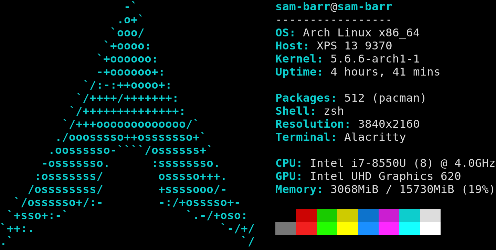

# paleofetch

A rewrite of [neofetch](https://github.com/dylanaraps/neofetch) in C.
Currently only supports Arch Linux on Xorg, but by shamelessly stealing code from other forks support for other distributions may be added in the future

## What this fork changes

This fork attempts to add several new commands to paleofetch, bringing it to near-feature parity with neofetch in terms of what can be displayed. Arbitrary shell commands can already be displayed, but this is obviously innefficient; caching helps somewhat with this, allowing for instant running most of the time.

The other major change is that arguments may be passed in to functions from `config.h`, increasing the flexibility of the code.

Changes left to make:

* Fix the `get-terminal` command.
* See how many processes are running
* See local IP address
* Fix GPU Detection, preferably without a shell script
* See currently logged-in users to the system
* Display the first line of an arbitrary line on the filesystem

Some eventual goals would be

* Support for wayland compositors also
* View CPU temperatures
* Fix the initial code base so that segmentation faults become impossible when weird input is given

## Why use paleofetch over neofetch?

The reason to use paleofetch is that it is much more performant. When not running any scripts, it can run in 3-6ms compared to nearly 200 using neofetch. Even when running a couple scripts, it is 2-3x faster because many of the modules are efficient C code.

### Example output:

## Dependencies

Paleofetch requires `libX11` and `libpci`. If you're running Xorg you should already have
the former. On Arch Linux, you should have `libpci` already installed if you have `pciutils`
installed. On other linux distrobutions, you may need to install libpci seperatley
if its not already present.

You also may need other programs to use the default scripts included (to get a WM's name, keyboard layouts in use, and perhaps more later). But of course you can always comment these out or write your own.

## Compiling

* `make` to build the program
* `make install` to install it (under $HOME/.local/bin by default)
* `make uninstall` to remove it from there
* `make debug` while you are testing it

## Usage

After compiling, simply run the executable:

    paleofetch

By default, `paleofetch` will cache certain  information (in either `/tmp/paleofetch-cache-file` or `$XDG_CACHE_HOME/paleofetch`)
to speed up subsequent calls. To ignore the contents of the cache (and repopulate it), run

    paleofetch --recache

or the shorthand

    paleofetch -r

The cache file can safely be removed at any time, paleofetch will repopulate it if it is absent.

Configuration
-------------

Paleofetch is configured by editing `config.h` and recompiling.
You can change your logo by including the appropriate header file in the logos directory.
The color with which paleo fetch draws the logo can be chosen by defining the `COLOR` macro,
look up ANSI escape codes for information on customizing this.

The last configuration is the `CONFIG` macro, which controls what information paleofetch
prints. Each entry in this macro should look like

    { "NAME: ",   getter_function, false }, \
    
Take note of the trailing comma and backslash. The first piece, `"NAME: "`, sets
what paleofetch prints before printing the information; this usually tells you what
bit of information is being shown. Note that the name entry should be unique for entries
which are to be cached. The second piece, `getter_function`, sets
which function paleofetch will call display. Paleofetch's original getter functions were

* `get_title`: prints `host@user` like in a bash prompt. Host and user will be printed in color.
* `get_bar`: Meant to be added after `get_title`, underlines the title
* `get_os`: Prints your operating system (including distrobution)
* `get_host`: Prints the model of computer
* `get_kernel`: Prints the version of the linux kernel
* `get_uptime`: Shows how long linux has been running
* `get_packages`: Shows how many packages you have installed. Currently only works for pacman.
* `get_shell`: Shows which shell you are using
* `get_resolution`: Prints your screen resolution
* `get_terminal`: Prints the name of your current terminal
* `get_cpu`: Prints the name of your CPU, number of cores, and maximum frequency
* `get_gpu`: (Tries to) print your current GPU
* `get_colors1`, `get_colors2`: Prints the colors of your terminal
* `get_battery_percentage`: I cannot test this as I have a desktop, but probably does what it says it does

This fork adds (so far)

* `run_shell_cmd`: runs a shell command and uses its standard output as the value
* `get_date`: Prints the date in a simple year-month-day hour:minute:second format
* `get_env`: Prints an environment variable's value
* `get_gtk_option`: Prints the value of a gtk variable, such as what theme you have set
* `get_disk_usage`: Prints the perecntage use of a drive given a path to where it is mounted

To include a blank line between entries, put `SPACER \` between the two lines
you want to separate.

The booleans in `CONFIG` tell paleofetch whether you want to cache an entry.
When cached, paleofetch will save the value and not recompute it whenever you run paleofetch
(unless you specify the `--recache` option).

The CPU and GPU name can be configured as well. This is done under the CPU_CONFIG and GPU_CONFIG section
in the config.h file. Two macros are provided to customize and tidy up the model names:

* `REMOVE(string)`: removes the first occurence of `string`
* `REPLACE(string1, string2)`: replaces the first occurence of `string1` with `string2`
